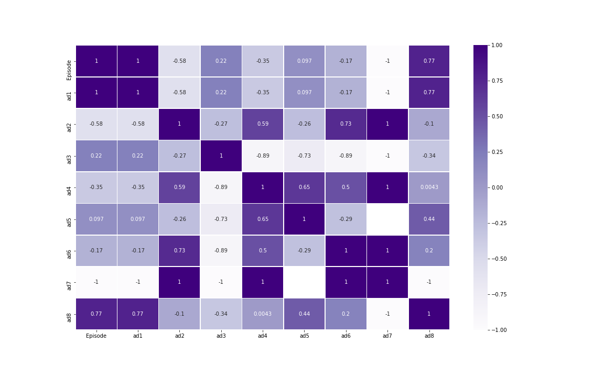

# Machine Learning

## Introduction to Regression and Prediction Algorithms

The various basics of Machine Learning using Python is displayed. Code of Regression models, ML models and different analytical tools are used.

## Liner Regression

The fundamental of Machine Learning Algorithm starts with Regression models. Linear regression is a linear model, e.g. a model that assumes a linear relationship between the input variables (x) and the single output variable (y). More specifically, that y can be calculated from a linear combination of the input variables (x).
Output Bar Chart:

## Correlation Matrix and Heatmap

A correlation matrix is a table showing correlation coefficients between variables. Each cell in the table shows the correlation between two variables. A correlation matrix is used to summarize data, as an input into a more advanced analysis, and as a diagnostic for advanced analyses.A heat map (or heatmap) is a data visualization technique that shows magnitude of a phenomenon as color in two dimensions. The variation in color may be by hue or intensity, giving obvious visual cues to the reader about how the phenomenon is clustered or varies over space.
Output Heatmap:

